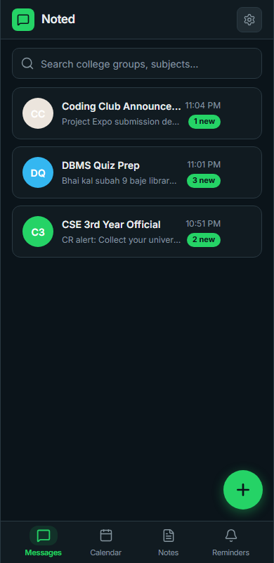
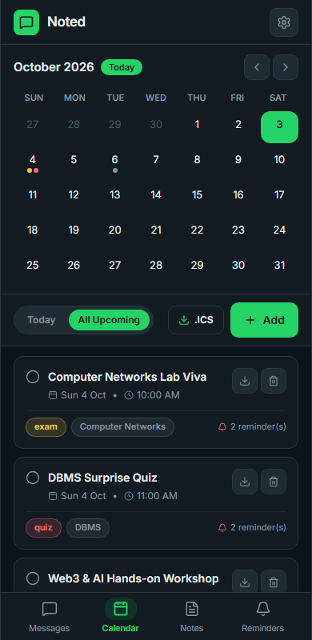
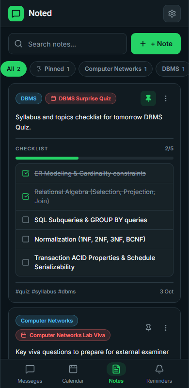
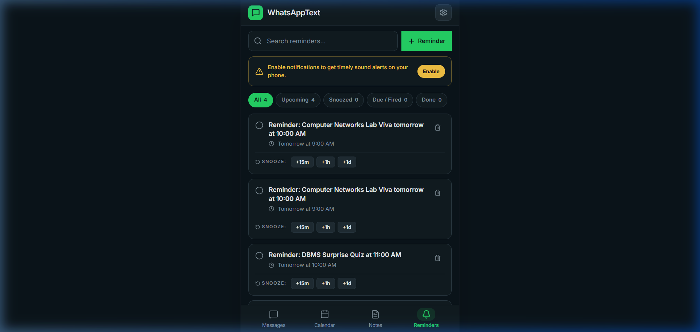

<div align="center">

# Noted

**Turn messy college WhatsApp messages into calendar events, notes and reminders, with one swipe.**

*Bhoolna mat. Don't forget.*

[](https://hacktoberfest.com)
[](https://dev.to)
[](LICENSE)
[](CONTRIBUTING.md)


[Download APK](../../releases) · [Report a bug](../../issues) · [Request a feature](../../issues) · [Read the DEV post](#)

</div>

---

## Screenshots

| Messages | Calendar | Notes | Reminders |
|---|---|---|---|
|  |  |  |  |

<!-- Add a short demo GIF here: docs/demo.gif -->

---

## The problem

Most college information now lives in WhatsApp groups: quiz dates, syllabus, assignment deadlines, room changes, holidays. It arrives buried between "good morning" messages and memes. To act on any of it, you have to:

1. leave WhatsApp,
2. open a calendar or notes app,
3. retype the date and details,
4. set a reminder,
5. go back and hope you did not lose your place.

People skip the steps, and then miss the quiz. This project was built for a friend who kept doing exactly that.

## The solution

Share (or paste) a WhatsApp message into **Noted**. It reads the message, understands the date and time (including Hinglish like *"kal 10 baje DBMS quiz, unit 3 tak"*), and lets you act on it with a single gesture:

- **Swipe right** to add it to your **Calendar**
- **Swipe left** to save it to your **Notes**
- **Long-press** to set a **Reminder**

Everything is stored on your phone. No account, no server, no tracking.

---

## Features

- **Message inbox, grouped like chats.** Shared and imported messages are grouped by WhatsApp group name.
- **Smart date and time parsing.**
  - English: `tomorrow`, `next Monday`, `15th Oct at 10am`, `18/10 5pm`
  - Hinglish: `aaj`, `kal`, `parso`, `agle somvar`, `is shanivar`, `subah`, `shaam`, `raat`, `10 baje`, `saadhe 9 baje`, `sawa 10 baje`, `paune 12 baje`
  - Devanagari: `कल सुबह ८ बजे`
  - Dates use **DD/MM** order. If a date is ambiguous (for example `11/12`), the app asks you to confirm instead of guessing.
  - If no time is mentioned, the event defaults to 9:00 AM and is marked **time unconfirmed**.
- **Automatic message labels.** Quiz, Exam, Deadline, Assignment, Holiday and Room change are detected from keywords (English and Hinglish), along with the subject (DBMS, OS, CN, DSA, Maths...) and topic (`unit 3`, `chapter 5`).
- **Calendar.** Month view plus an agenda list. Every event links back to the original message. Export any event to a standard `.ics` file with built-in alarms.
- **Notes.** Save important messages, group them by subject, pin them, search them, and keep a **checklist of quiz topics** you can tick off.
- **Reminders that fire even when the app is closed.** Uses scheduled local notifications on Android, with **Done** and **Snooze** actions.
- **Undo for every swipe.** Swipe actions are never destructive, and every one has a visible menu alternative.
- **Private and offline.** All data stays on your device. Export or delete everything from Settings.

---

## How to use it for your own productivity

### 1. Get messages into the app

WhatsApp does not allow other apps to read your messages, and this project does not pretend otherwise. Use any of these:

| Method | Steps |
|---|---|
| **Share to Noted** (fastest) | In WhatsApp, long-press a message, tap Share (or Forward, then pick the share sheet), and choose **Noted**. |
| **Paste** | Copy a message in WhatsApp, open Noted, tap **+**, and paste. |
| **Import a chat** | In WhatsApp, open a chat, tap the menu, then **More**, then **Export chat**, choose *Without media*, and share the `.txt` file to Noted (or use **+ > Import chat**). |

### 2. Act on a message

| Gesture | What happens |
|---|---|
| Swipe right | Opens a pre-filled calendar event. Confirm the date, then save. |
| Swipe left | Saves the message to Notes (grouped by subject). |
| Long-press | Remind me in 10 min, 1 hour, tonight, 1 day before, or a custom time. |
| Tap **Undo** | Reverses the last action. |

### 3. Handy workflows

- **Quiz week.** Swipe the quiz message right (calendar + automatic reminders), then swipe the syllabus message left (notes). Tick off topics on the checklist as you revise.
- **Assignments.** Swipe deadline messages right. You get a reminder the day before and an hour before.
- **Semester archive.** Import a whole group's chat once. Important messages are already labelled, so you can scroll to just the quizzes and deadlines.
- **Share with your phone's calendar.** Export an event as `.ics` and open it in Google Calendar or any calendar app to get its reliable system alarms.

---

## Install

### Option A: Download the APK

1. Go to the [Releases](../../releases) page and download the latest `.apk`.
2. Open it on your Android phone. If prompted, allow installs from this source.
3. On first launch, allow **notifications** (and **exact alarms** on Android 12+) so reminders work.

### Option B: Run it from source
 
```bash
git clone https://github.com/SkjOO5/Noted.git
cd Noted
npm install

# start the local dev server
npm run dev

# run tests
npm run test
npm run e2e
```

### Build an APK yourself

```bash
# Build production web bundle, sync Capacitor, and compile Android APK
npm run apk:build
```

---

## How it works

```
 WhatsApp message
        |
        v
 [ Import ]  share intent / paste / exported .txt
        |
        v
 [ Normalizer ]  Hinglish and Devanagari -> English tokens
        |
        v
 [ Date parser ]  reference date = the message's own timestamp
        |
        v
 [ Classifier ]  type, subject, topic, importance
        |
        v
 [ Local database ]  messages, events, notes, reminders
        |
        v
 swipe -> Calendar / Notes     long-press -> scheduled local reminder
```

Key design decisions:

- **The parser is pure TypeScript with unit tests.** It never touches the UI or database, so it is easy to test and to extend. Fixtures live in `src/lib/parser/__tests__/`.
- **Relative dates use the message's own timestamp**, not today's date. "kal quiz hai" sent last Friday means *last Saturday*, and importing an old chat stays correct.
- **No silent guessing.** Ambiguous dates and missing times are surfaced to the user.
- **Local-first.** No backend, no analytics, no network calls for your data.

## Tech stack

| Area | Tool |
|---|---|
| App | React 18, Vite, TypeScript, Tailwind CSS |
| Mobile Runtime | Capacitor Android |
| Storage | IndexedDB (Dexie.js) on-device |
| Date parsing | chrono-node plus custom Hinglish & Devanagari normalizer |
| Reminders | Local scheduled notifications via Capacitor |
| Calendar export | Hand-written `.ics` generator with `VALARM` |
| Tests | Vitest (unit/parser) + Playwright (E2E multi-viewport) |

## Project structure

```
src/
  db/             database schema and repositories
  lib/
    parser/       Hinglish normalizer, date parser, message classifier
    chat/         WhatsApp export parsing and de-duplication
    remind/       reminder scheduling
    calendar/     .ics export
  features/       messages, calendar, notes, reminders, settings
  components/     shared UI components
  styles/         design tokens
```

---

## Honest limitations

- **No WhatsApp API.** Messages come in through Share, paste or chat export. Automatic reading of your chats is not supported.
- **Android first.** iOS is not a target for this release.
- **Reminder reliability depends on the phone.** Some manufacturers aggressively kill background apps. If reminders are late, disable battery optimization for the app. For critical events, also export the `.ics` so your calendar app can alarm too.
- **Parsing is heuristic.** It handles common English, Hinglish and Devanagari phrasing but not every sentence. Wrong or missing results are good bugs to report (see below).
- **Language coverage.** Other Indian languages and scripts are not supported yet.

---

## Contributing (Hacktoberfest welcome!)

This project is part of **Hacktoberfest 2026**. Contributions of all sizes are welcome, including docs, tests, translations and design.

1. Fork the repository and create a branch: `git checkout -b feat/my-change`
2. Make your change, and add or update tests where it makes sense.
3. Run `npm run typecheck` and `npm test`.
4. Open a pull request describing what changed and why.

Please read [CONTRIBUTING.md](CONTRIBUTING.md) and the [Code of Conduct](CODE_OF_CONDUCT.md) first.

### Good first issues

Look for the `good first issue` and `hacktoberfest` labels. Ideas to get started:

- [ ] Add more Hinglish phrases to the date parser, with test cases
- [ ] Add subject abbreviations used at your college
- [ ] Support another language or script (Bengali, Marathi, Tamil, Urdu...)
- [ ] Improve accessibility (labels, contrast, large font sizes)
- [ ] Add a light theme polish pass
- [ ] Add a widget for today's events
- [ ] Write a tutorial or translate this README

### Helping the parser improve

Found a message that parsed wrongly? Open an issue using the **Parser bug** template with the message text (remove names and phone numbers), what you expected, and what you got. Even better, add it to the fixtures file as a failing test.

---

## Roadmap

- [ ] Opt-in capture of WhatsApp notifications (on-device only)
- [ ] Home-screen widget for upcoming quizzes
- [ ] Recurring events (weekly labs, timetable import)
- [ ] Timetable image import
- [ ] More languages
- [ ] Encrypted backup and restore

---

## Privacy

All data is stored locally on your device. The app does not require an account and does not send your messages anywhere. You can export or delete all data in **Settings**.

## Built for the DEV Hacktoberfest Weekend Challenge

Theme: **Build for a Friend.** This was built for a friend who kept missing quiz dates because the information was hidden in WhatsApp groups. If it helps you too, a star would make my week.

## License

Released under the [MIT License](LICENSE).

## Acknowledgements

- [chrono-node](https://github.com/wanasit/chrono) for natural-language date parsing
- The Hacktoberfest and DEV communities
- Everyone who missed a quiz and inspired this app
